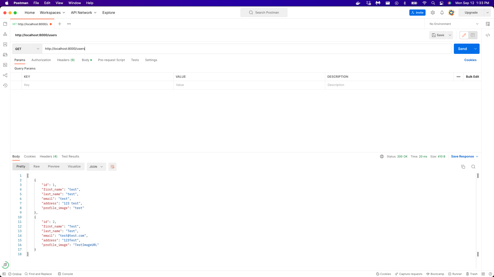
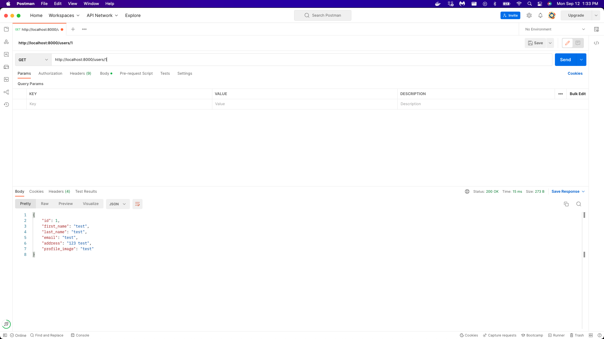
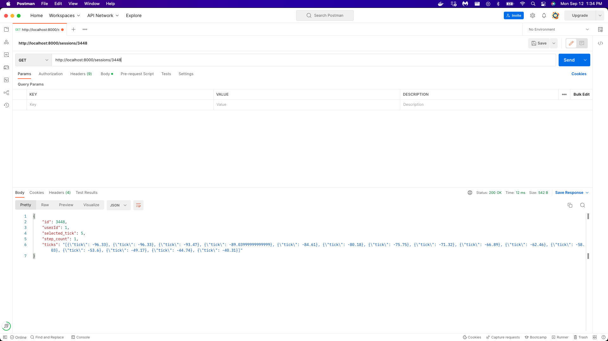

# Concha Assessment

## Setup:

With Debugger in VSCODE:
- clone repository to working directory
- navigate to ```src/request_handler.py```
- run debugger from ```src/request_handler.py``` deploy server
- server should be deployed locally to query with API tools like Postman

With Docker:
- clone repository to working directory
- from project directory run ```docker run -p 8000:8000 concha-server:latest```
- server should be deployed locally to query with API tools like Postman

## Screenshots:
### Getting All Users


### Getting Single User


### Session Data

